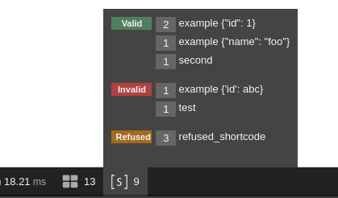

EkinoResponseShortcodeBundle
=========================


[](https://travis-ci.com/phucwan91/ResponseShortcodeBundle)


This is a *work in progress*, so if you'd like something implemented please
feel free to ask for it or contribute to help us!

# Purpose

It works by listening `the response event` so the content which output from shortcodes is embedded right before a request returns a response.

Therefore, you can use the shortcode in anywhere and how many you want. E.g in the twig files, blocks, in translation files, in texts that are stored in database, etc...

# Installation

## Step 1: add dependency

```bash
$ composer require ekino/response-shortcode-bundle
```

## Step 2: register the bundle

### Symfony 2 or 3:

```php
<?php

// app/AppKernel.php

public function registerBundles()
{
    $bundles = [
        // ...
        new Ekino\ResponseShortcodeBundle\ResponseShortcodeBundle(),
        // ...
    ];
}
```

### Symfony 4:

```php
<?php

// config/bundles.php

return [
    // ...
    Ekino\ResponseShortcodeBundle\ResponseShortcodeBundle::class => ['all' => true],
    // ...
];
```

## Step 3: configure the bundle

```yaml
ekino_response_shortcode:
    format_tag:    '[[+]]'                                                     # default
    validator:     Ekino\ResponseShortcodeBundle\Service\ShortcodeValidation   # default
    cache_handler: Ekino\ResponseShortcodeBundle\Service\ShortcodeCacheHandler # default
    excluded_uri_pattern:
        - ^(.*)api(.*)
```

# Usage

#### The Syntax:

    [[ your_short_code ]]
    
The open tag `[[` and closed tag `]]` can be changed to whatever by using the `format_tag` option, the value must have `+` as concatenation, Example

     `format_tag: {{+}}`  

It also accepts to use parameters which is a  json string but **only accepts one**.

    [[ your_short_code {"name": "your name", "email": "your email"} ]]

<em>The spaces in a shortcode are not important</em>.

#### To create new shortcode:

Create a new class that implements the interface `Ekino\ResponseShortcodeBundle\Service\ShortcodeInterface`.

For convenience, extend from the `Ekino\ResponseShortcodeBundle\Service\AbstractShortcode` class, which implements the interface and provides some utilities and the `$this->options` property to work with the parameters which uses `OptionsResolver`. Example:

    class ExampleShortCode extends AbstractShortcode
    {
        /**
         * @inheritDoc
         */
        function setDefaultOptions(OptionsResolver $resolver): void
        {
            $resolver->setDefaults([
                'id'   => 1,
                'name' => 'john',
            ]);
        }
    
        /**
         * @inheritDoc
         */
        public function getTag(): string
        {
            return 'example';
        }
    
        /**
         * @inheritDoc
         */
        public function output(): string
        {
            // $this->options
            return '<p>welcome</p>';
        }
        
        /**
         * @inheritDoc
         */
        public function isInvoked(): bool
        {
            return true;
        }
    }
        

- `getTag()` method: The value that returns from the method `getTag` method is used to rule the tag name of a shortcode:   
- `output()` method : Put your business code in the `output` method.
- `isInvoked()` method: Put your conditional if you want your shortcode is invoked in specific situation  
- You don't need to specify any tag for the shortcode class when you register it as service, as long as you implement the `ShortcodeInterface`

#### More
- It only renders the shortcodes when a request has `GET` method and its `URI` is not included in the `excluded_uri_pattern` option. If it isn't strict enough for your project, overwrite the `Ekino\ResponseShortcodeBundle\Service\ShortcodeValidation` or implement the `Ekino\ResponseShortcodeBundle\Service\ShortcodeValidationInterface`. Then, register it in the `validator` option. Remember that the first argument in its constructor is always an array `$excludedUris`

- It's using `Symfony cache` to cache shortcode outputs. If you have another cache adapter, overwrite the `Ekino\ResponseShortcodeBundle\Service\ShortcodeCacheHandler` or implement the `Ekino\ResponseShortcodeBundle\Service\ShortcodeCacheHandlerInterface` and also register it in the `cache_handler` option.

#### Bonus    

- The debug toolbar can give you some useful information about shortcodes   
   
   

#### Notice:
  - It cannot handle a submitted form logical part.
 

